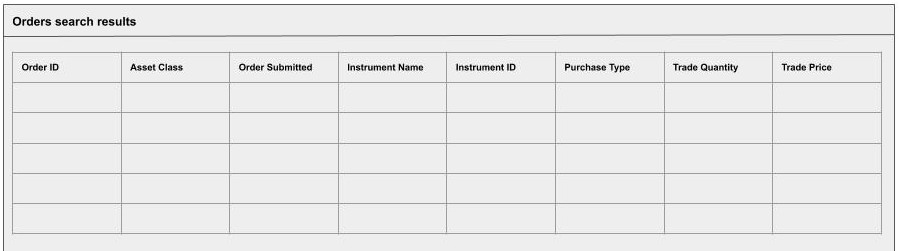
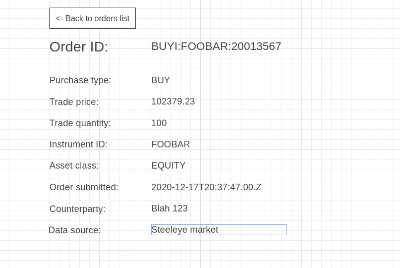
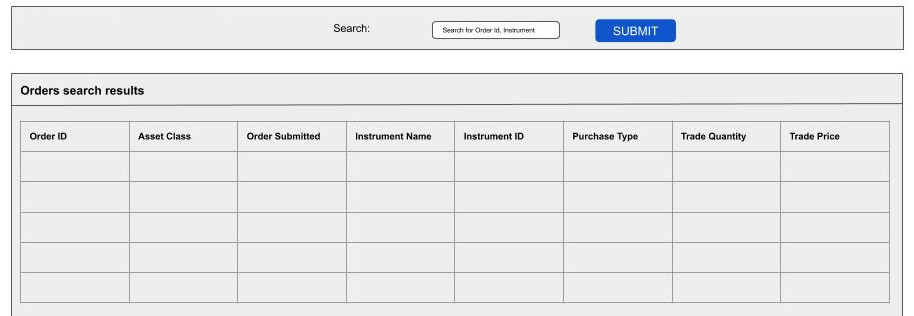
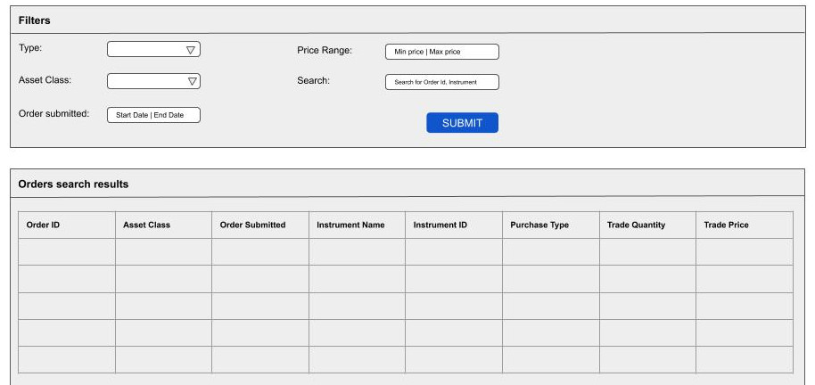

# SteelEye full-stack developer

# Table of Contents

1.  [Introduction](#org4d07f0e)
    1.  [Constraints](#org8e1bd48)
    2.  [Database](#orgf12f703)
        1.  [Connection](#org65255a1)
        2.  [Schema](#org44bde2d)
2.  [Test](#org7105ef8)
    1.  [Listing orders](#org7948595)
    2.  [Single orders](#org90176e9)
    3.  [Orders search](#orgc4edae7)
    4.  [Advanced search](#org6016d2e)
    5.  [Bonus points](#orgf4ad3e9)


<a id="org4d07f0e"></a>

# Introduction

In this exercise, you'll be building an API with endpoints serving
contents from an ElasticSearch database provided for you. You will
build a React front-end on top of this API.


<a id="org8e1bd48"></a>

## Constraints

You are expected to write the API in Python with one of the following
frameworks:

-   FastAPI
-   Flask
-   Django

The front-end must be written with React and be a single-page
application.

Finally you must connect to the ElasticSearch database and
query it dynamically in your API code.


<a id="orgf12f703"></a>

## Database

You have access to a database of orders. An order is a financial
transaction.


<a id="org65255a1"></a>

### Connection

The database is available at the url `<INSERT HERE>`.

The Orders are stored in the index `.order`.


<a id="org44bde2d"></a>

### Schema

The Elasticsearch schema for an Order is as follows:

```json
    {
      "properties": {
        "&id": {
          "type": "keyword"
        },
        "&model": {
          "type": "keyword"
        },
        "assetClass": {
          "type": "keyword"
        },
        "counterparty": {
          "properties": {
            "name": {
              "type": "keyword"
            }
          }
        },
        "dataSource": {
          "properties": {
            "name": {
              "type": "keyword"
            }
          }
        },
        "instrumentId": {
          "type": "keyword"
        },
        "instrumentName": {
          "type": "keyword"
        },
        "orderId": {
          "type": "keyword"
        },
        "purchaseType": {
          "type": "keyword"
        },
        "timestamps": {
          "properties": {
            "orderSubmitted": {
              "type": "date"
            }
          }
        },
        "tradeData": {
          "properties": {
            "quantity": {
              "type": "integer"
            },
            "price": {
              "type": "integer"
            },
            "trader": {
              "type": "keyword"
            }
          }
        }
      }
    }
```

<a id="org7105ef8"></a>

# Test


<a id="org7948595"></a>

## Listing orders

As a first exercise, you will be writing an API to list all orders
in the ElasticSearch database and display them all on a web-page.


<a id="org528f078"></a>

### API

Write an API endpoint to list orders stored in the elasticsearch
database. An Order from the API is a subset of the Order fields
stored in the ElasticSearch database.

Resource: `/orders`

Method: `GET`

Schema for a single order:

```json
    {
      "assetClass": { "type": "string" },
      "instrumentId": { "type": "string" },
      "instrumentName": { "type": "string" },
      "orderId": { "type": "string" },
      "orderSubmitted": {
        "type": "string",
        "format": "date-time"
      },
      "purchaseType": {
        "type": "string",
        "enum": ["BUY", "SELL"]
      },
      "tradePrice": { "type": "number" },
      "tradeQuantity": { "type": "number" }
    }
```

Example response to `GET /orders`:

```json
    [
      {
        "assetClass": "Equity",
        "instrumentId": "AAPL",
        "instrumentName": "Apple Inc.",
        "orderId": "BUYI:FOOBAR123456",
        "...": "more..."
      },
      { ... }
    ]
```


<a id="org9628ee4"></a>

### Front-end

The front-end will list all orders returned by the endpoint, as
depicted in the mock-up below.



You are free to apply any theme you'd like.


<a id="org90176e9"></a>

## Single orders

We want to be able to single out an order and see more details about
this order. To this end, you will need to write an API endpoint to
retrieve data about a specific order, and a front-end view of a single
order.


<a id="org420e39a"></a>

### API

Resource: `/orders/{order_id}`

Method: `GET`

Schema:

```json
    {
      "assetClass": { "type": "string" },
      "instrumentId": { "type": "string" },
      "instrumentName": { "type": "string" },
      "orderId": { "type": "string" },
      "orderSubmitted": {
        "type": "string",
        "format": "date-time"
      },
      "purchaseType": {
        "type": "string",
        "enum": ["BUY", "SELL"]
      },
      "tradePrice": { "type": "number" },
      "tradeQuantity": { "type": "number" },
      "counterpartyName": { "type": "string" },
      "dataSourceName": { "type": "string" },
    }
```

We're adding `counterpartyName` and `dataSourceName` to the resource.


<a id="org7446da4"></a>

### Front-end

We want to be able to click on one of the orders in the orders list you
previously built. Doing this will change the view to a detail page for
the selected order.

Additionally, we want to be able to access the detailed view of an
order directly through the browser URL so we can share links to orders.

Below is a mockup of the single-order page.




<a id="orgc4edae7"></a>

## Orders search

Displaying all orders all the time is inefficient. So we'd like to
instead limit the number of fetched orders and offer a search feature
for the list of orders.


<a id="org28ac5a1"></a>

### API

You will need to modify your endpoint to list orders and limit its
size to 20 orders only.

The endpoint will need to support an optional `search` query parameter
that will search for matching orders through the following fields:

-   `instrumentName`
-   `instrumentId`
-   `counterparty.name`


<a id="orgf30c2e7"></a>

### Front-end

Add a search field atop the list of orders. The user will enter their
search text in this field.

A button next to the search field will run the search.

The user can alternatively press `ENTER` to execute the search when
the search field is focused.




<a id="org6016d2e"></a>

## Advanced search

Our users now want to be able to narrow down on specific orders from
most of their fields. You'll need to support a set of criteria in the
API endpoint to list orders, and an advanced search form to match in
the front-end.


<a id="orgf7d8046"></a>

### API

Modify your `/orders` API endpoint to support the following new
optional query parameters:

<table border="2" cellspacing="0" cellpadding="6" rules="groups" frame="hsides">


<colgroup>
<col  class="org-left" />

<col  class="org-left" />
</colgroup>
<thead>
<tr>
<th scope="col" class="org-left">Parameter</th>
<th scope="col" class="org-left">Description</th>
</tr>
</thead>

<tbody>
<tr>
<td class="org-left"><code>assetClass</code></td>
<td class="org-left">Asset class of the order.</td>
</tr>


<tr>
<td class="org-left"><code>maxOrderSubmitted</code></td>
<td class="org-left">The maximum date for <code>timestamps.orderSubmitted</code> field.</td>
</tr>


<tr>
<td class="org-left"><code>maxPrice</code></td>
<td class="org-left">The maximum value for <code>tradeData.price</code> field.</td>
</tr>


<tr>
<td class="org-left"><code>minOrderSubmitted</code></td>
<td class="org-left">The minimum date for <code>timestamps.orderSubmitted</code> field.</td>
</tr>


<tr>
<td class="org-left"><code>minPrice</code></td>
<td class="org-left">The minimum value for <code>tradeData.price</code> field.</td>
</tr>


<tr>
<td class="org-left"><code>purchaseType</code></td>
<td class="org-left">The trade is BUY or SELL.</td>
</tr>
</tbody>
</table>

All maximum and minimum fields are inclusive (e.g. minPrice=2&maxPrice=10 will
return 2 <= tradePrice <= 10).

The output schema remains unchanged.


<a id="org6f3b549"></a>

### Front-end

Turn the search field into a full advanced search form that will allow the user
to fill in the new query parameter for the back-end.

See the mock-up below for reference:




<a id="orgf4ad3e9"></a>

## Bonus points

Implement a pagination on the list of orders (both API and front-end).
