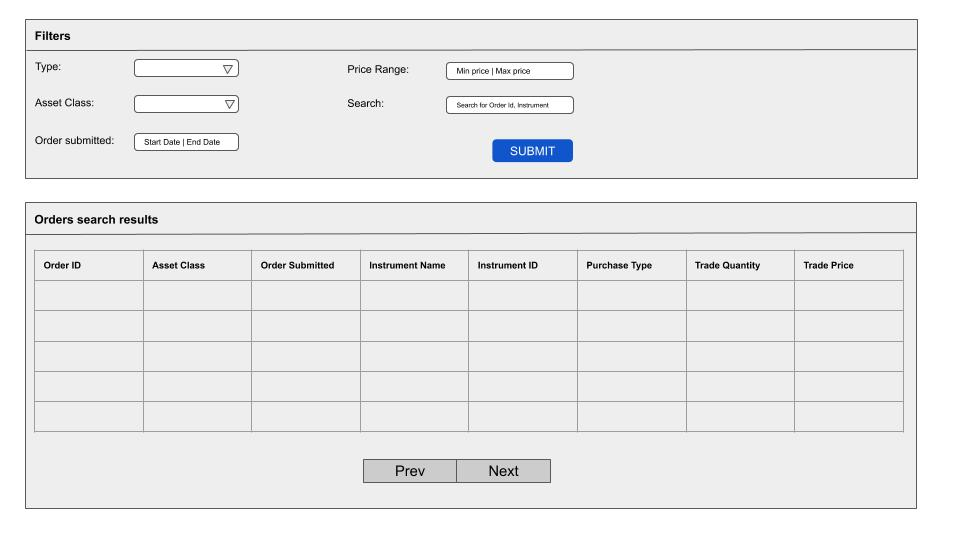

# SteelEye full-stack developer - Orders filters and listing problem (Part - 2)

## Frontend

Create a simple web page using React for the the above filters listing. You can use any library for date input and price range input if needed.

### Design considerations:
- User should see 5 filters given below in the UI with a `Submit` button.
- On clicking `Submit` button, call the API created in the previous task and get the result.
- Show this result as a paginated table with the below columns.

### Filters:

| Filter                 | Key                                       |  UI Type                                          |
|------------------------|-------------------------------------------|---------------------------------------------------|
| Type                   | `type`                                    |  Single select Dropdown with `type` enums.        |
| Search                 | `search`                                  |  Input text search on `orderId`, `instrumentName`.|
| Asset Class            | `assetClass`                              |  Single select Dropdown with `assetClass` enums.  |
| Order Submitted Range  | `minOrderSubmitted`, `maxOrderSubmitted`  |  Date Range                                       |
| Price range            | `minPrice`, `maxPrice`                    |  min and max number input fields.                 |

### Table:

Simple table with pagination.

| Column                 | Map to key        |
|------------------------|-------------------|
| Order ID               | `orderId`         |
| Asset Class            | `assetClass`      |
| Order Submitted        | `orderSubmitted`  |
| Instrument Name        | `instrumentName`  |
| Instrument ID          | `instrumentId`    |
| Purchase Type          | `purchaseType`    |
| Trade Quantity         | `tradeQuantity`   |
| Trade Price            | `tradePrice`      |

### UX

Rough mockup for the UI.

